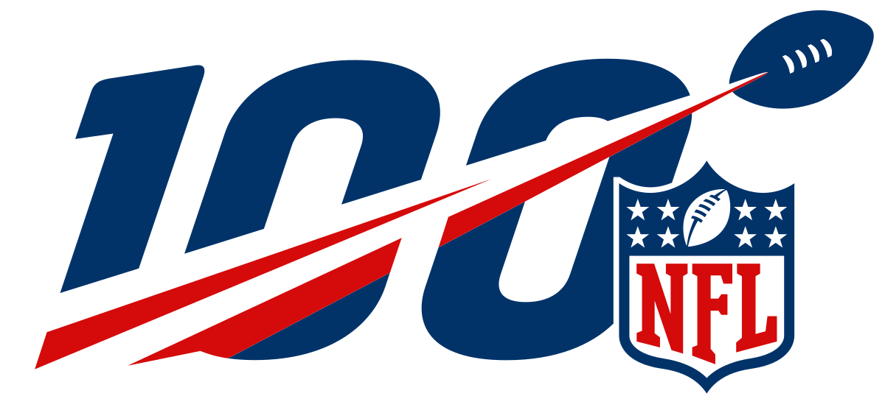

# NFL Predictor 

## Background
According to bettingpros.com, only 13 of the top 80 bettors had a win percentage of 70% or higher on
NFL Moneyline (<a href="https://en.wikipedia.org/wiki/Fixed-odds_betting#Moneyline_odds">What is a Moneyline?</a>) for the 2020 season.

This project aims to see if we can use Machine Learning with readily available team stats to join the 70%+ club.

## Data
[Data Guide](/Data/DATAGUIDE.md)

## Method
For our first prediction method we used the random forest classifier model. This model fits a specified number of decision trees and chooses the best one.

## Results

## Conclusion

## References

## Further Reading
* https://beta.vu.nl/nl/Images/werkstuk-bosch_tcm235-888637.pdf

